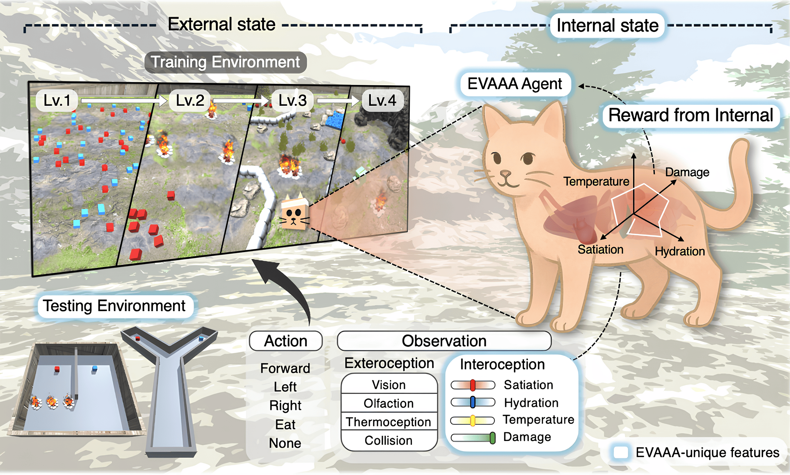
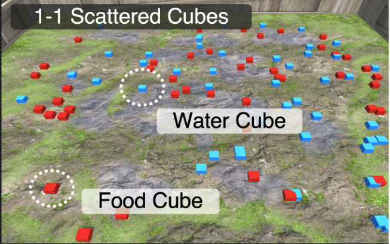
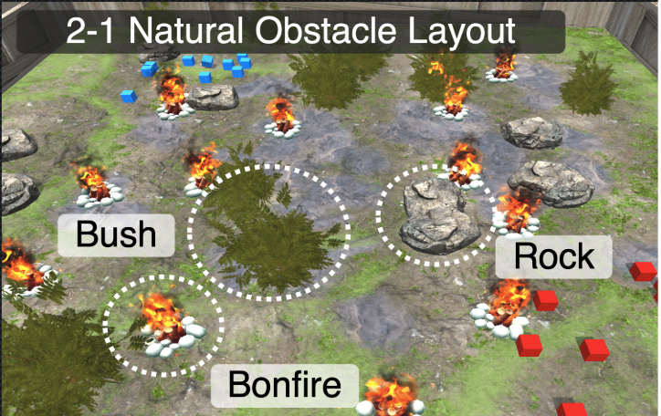
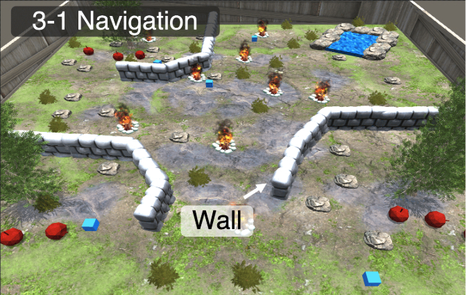
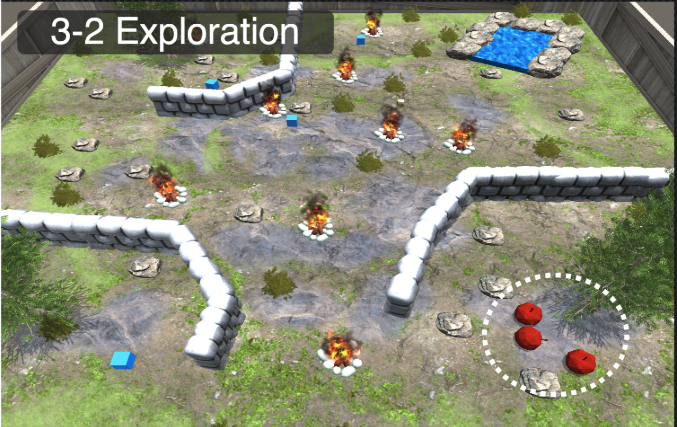

[](https://creativecommons.org/licenses/by-nc-sa/4.0/)
[](https://www.python.org/downloads/)
[](https://unity.com/releases/editor/whats-new/2022.3.16)

# EVAAA: Essential Variables in Autonomous and Adaptive Agents

<!-- 
 -->
 <p align="center">
  
</p>

EVAAA (Essential Variables in Autonomous and Adaptive Agents) is a biologically inspired 3D simulation platform for reinforcement learning (RL) research. Unlike traditional RL environments that rely on externally defined, task-specific rewards, EVAAA grounds agent motivation in the regulation of internal physiological variables—such as food, water, thermal balance, and damage—mirroring the homeostatic drives found in biological organisms.

A unique strength of EVAAA is its dual-environment architecture:
- **Progressive Survival Curriculum:** Agents are trained in a sequence of naturalistic environments of increasing complexity, where they must autonomously maintain essential variables under dynamic, multimodal conditions. This curriculum scaffolds the emergence of adaptive survival behaviors, from basic resource foraging to environments with obstacles, predators, and temporal changes.
- **Unseen Experimental Testbeds:** Beyond the training curriculum, EVAAA provides a suite of controlled, previously unseen test environments. These testbeds are designed to isolate and rigorously evaluate specific decision-making challenges—such as resource prioritization, collision avoidance, thermal risk, multi-goal planning, and adaptive behavior under novel conditions—enabling systematic assessment of generalization and internal-state-driven control.

Key features include:
- **Multimodal Perception:** Agents experience the world through vision, olfaction, thermoception, collision detection, and interoception.
- **Unified, Intrinsic Reward System:** Rewards are derived from internal state dynamics, enabling autonomous goal generation and reducing the need for manual reward engineering.
- **Modular & Extensible Design:** All core systems (Agent, Environment, Event, SceneControllers, UI, Utility) are highly modular and configurable via JSON, supporting rapid experiment iteration and reproducibility.

## 🤖 Emergent Behavior of the Agent

|type| Unsuccessful Agent in Two-Resource Scenario | Successful Agent in Two-Resource Scenario |
|:-------------------:|:-------------------------------------------:|:-----------------------------------------:|
| training |||
| testing | <br><sub>This agent operated only in level-1-1,<br>where resources are readily accessible and visible.</sub> | <br><sub>This agent navigated level-2-1,<br>where resources must be actively searched for and are less apparent.</sub> |


|type| Normal Foraging Behavior | Abnormal Self-Terminating Behavior |
|:-------------------:|:-------------------------------------------:|:-----------------------------------------:|
| training |||
| testing | <br><sub>This agent was trained on level-3-1, where food resources are located in consistent and predictable positions.</sub> | <br><sub>In level-3-2, dynamic resource locations increased uncertainty, prompting the agent to self-terminate early when food was not found to avoid negative rewards.</sub> |


## 📝 Overview
EVAAA (Essential Variables in Autonomous and Adaptive Agents) is a research platform for studying autonomy, adaptivity, and internal-state-driven control in reinforcement learning (RL) agents. The project consists of two main components:

> ⚠️ ** Note for users viewing the repository via [https://anonymous.4open.science/r/evaaa-2486](https://anonymous.4open.science/r/evaaa-2486) **  
> To ensure the links below function correctly, please first **manually click** on the `evaaa_unity` and `evaaa_train` folders  from the left sidebar.  
> This step initializes the folder context and allows the linked documentation to load properly.
 
- **Unity Simulation Environment** ([evaaa_unity](./evaaa_unity/README.md)): A 3D, multimodal, curriculum-based environment where agents must regulate internal physiological variables (food, water, thermal, damage) to survive and adapt. Built with Unity ML-Agents, supporting rich sensory input and flexible configuration.
- **Python Training Suite** ([evaaa_train](./evaaa_train/README.md)): A modular training and evaluation framework (based on SheepRL) for developing RL agents in the EVAAA environment. Includes implementations of DQN, PPO, and DreamerV3, with tools for logging, evaluation, and curriculum learning.

---

## 📦 Repository Structure

```
.
├── evaaa_unity/   # Unity simulation environment (C#, Unity ML-Agents)
│   └── README.md  # Detailed Unity environment usage & setup
├── evaaa_train/   # Python training & evaluation suite
│   └── README.md  # Detailed training usage & setup
└── README.md      # (You are here)
```

- **`evaaa_unity/`**: Contains the Unity project for the EVAAA simulation environment. See [`evaaa_unity/README.md`](./evaaa_unity/README.md) for setup, configuration, and usage instructions.
- **`evaaa_train/`**: Contains the Python code for training and evaluating RL agents in EVAAA. See [`evaaa_train/README.md`](./evaaa_train/README.md) for installation, training commands, and evaluation details.

---

## 🚀 Quickstart Navigation

| Component         | Description                                      | Quick Link                                  |
|-------------------|--------------------------------------------------|---------------------------------------------|
| Unity Environment | 3D simulation, agent embodiment, configuration   | [evaaa_unity](./evaaa_unity/README.md) |
| Python Training   | RL algorithms, logging, evaluation, curriculum   | [evaaa_train](./evaaa_train/README.md) |

- **New to EVAAA?**
  1. Start with the [Unity environment setup](./evaaa_unity/README.md) to explore or customize the simulation.
  2. Then follow the [Python training guide](./evaaa_train/README.md) to train and evaluate RL agents.

---


## 📬 Contact
<!-- Contact information for questions or collaboration -->

## 🙏 Acknowledgements
<!-- Credits for Unity ML-Agents, asset sources, and any collaborators or funding sources -->

## 📚 Citing EVAAA

## 📄 License
This project is licensed under the [License: CC BY-NC-SA 4.0](https://creativecommons.org/licenses/by-nc-sa/4.0/).

