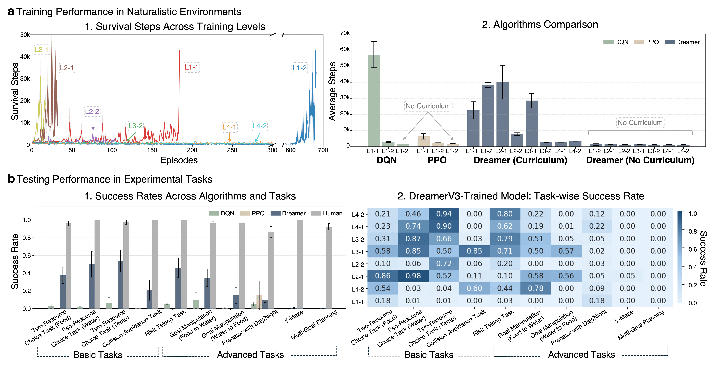

[](https://creativecommons.org/licenses/by-nc-sa/4.0/)
[](https://www.python.org/downloads/)
[](https://pytorch.org/)

# EVAAA: Python Interface for Training and Evaluation

This folder contains a modified version of the [SheepRL](https://github.com/Eclectic-Sheep/sheeprl) training framework, adapted for EVAAA training and evaluation needs. The codebase maintains the core structure of SheepRL while incorporating custom modifications.

## 📄 Table of Contents
- [EVAAA: Python Interface for Training and Evaluation](#evaaa-python-interface-for-training-and-evaluation)
  - [📄 Table of Contents](#-table-of-contents)
  - [🧮 Implemented Algorithms](#-implemented-algorithms)
  - [🎮 Environment Setup](#-environment-setup)
  - [🔧 Requirements](#-requirements)
  - [🚀 Quick Start](#-quick-start)
  - [🎮 Minimal Environment Interaction](#-minimal-environment-interaction)
  - [📊 Observation Space](#-observation-space)
    - [Vector Observations (obs\[1\])](#vector-observations-obs1)
    - [Example Usage](#example-usage)
  - [🎯 Action Space](#-action-space)
    - [Example Usage](#example-usage-1)
  - [🚀 Usage](#-usage)
    - [Training](#training)
    - [Parameters](#parameters)
    - [Evaluation](#evaluation)
  - [⚙️ Configuration](#️-configuration)
  - [📊 Logging](#-logging)
    - [Recording Outputs](#recording-outputs)
  - [🔧 Troubleshooting](#-troubleshooting)
  - [📄 License](#-license)

<a id="implemented-algorithms"></a>
## 🧮 Implemented Algorithms

This folder includes three main algorithms:
- **DreamerV3**: Implemented from SheepRL framework
- **PPO (Proximal Policy Optimization)**: Implemented from SheepRL framework
- **DQN (Deep Q-Network)**: Custom implementation by our team

<!--  -->
<p align="left">
  
</p>


The training results are stored in the [plotting](/evaaa_train/plotting/) directory.

<a id="environment-setup"></a>
## 🎮 Environment Setup

Before running any examples or training, you need to download and set up the Unity environment:

```bash
# Install gdown for downloading from Google Drive
pip install gdown

# Download and setup the environment
# For Linux
gdown --fuzzy "https://drive.google.com/file/d/1-FvdnIklQSZMsTzlfiUPHevXcvSibiX5/view?usp=sharing"

# For Mac
gdown --fuzzy "https://drive.google.com/file/d/17gCeY2c6-wkU4MTXgGrxJ4eT1lkhIndG/view?usp=sharing"

# For Windows
gdown --fuzzy "https://drive.google.com/file/d/1fB7fDemUG38p8id2hnwlpACjHbq5fZtH/view?usp=sharing"

unzip evaaa.zip -d envs/
rm evaaa.zip
```

<a id="requirements"></a>
## 🔧 Requirements

⚙️ Python=3.10.1

The project requires the following dependencies:
```
mlagents_envs==1.1.0
numpy==1.23.5
torch==2.5.0
hydra-core==1.3.0
lightning==2.5.0
tensorboard==2.18.0
rich==13.9.4
gymnasium==1.0.0
opencv-python==4.10.0.84
```

Install the dependencies using pip:
```bash
pip install -r requirements.txt
```

<a id="quick-start"></a>
## 🚀 Quick Start

After setting up the environment, you can:

1. Run the basic example to verify the installation:
```bash
python simple_example.py
```

2. Start training with one of the implemented algorithms:
```bash
python train.py exp=dqn tag=dqn_tet seed=42 env.port=50000 env.time_scale=15 env.width=100 env.height=100 env.config=train-level-1.1-ScatteredResource
```

For more training options and configurations, see the [Usage](#usage) section.

<a id="minimal-environment-interaction"></a>
## 🎮 Minimal Environment Interaction

The EVAAA uses Unity ML-Agents for environment interaction. For detailed documentation about the ML-Agents API, please refer to the [official ML-Agents documentation](https://github.com/Unity-Technologies/ml-agents/tree/main/ml-agents-envs). For a complete example with environment interaction, including all observation types (visual, essential variables, olfactory, temperature, collision) and proper action handling, please refer to [`simple_example.py`](./simple_example.py). Here's a minimal example showing the basic structure:

```python
from mlagents_envs.environment import UnityEnvironment, ActionTuple

# Initialize environment
env = UnityEnvironment(
    file_name='./envs/evaaa/build',
    seed=42,
    base_port=50000,
)

# Get behavior name and reset environment
env.reset()
behavior_name = list(env.behavior_specs)[0]

# Simple interaction loop
for _ in range(10): 
    # Execute action
    action = ActionTuple()
    action.add_discrete([[1]])  # Move forward
    env.set_actions(behavior_name, action)
    env.step()
    
    # Get observations
    decision_steps, terminal_steps = env.get_steps(behavior_name)
    for agent_id in decision_steps:
        obs = decision_steps[agent_id].obs
        print(f"Visual shape: {obs[0].shape}")
        print(f"State vector: {obs[1]}")

env.close()
```

This example demonstrates:
- Environment initialization
- Basic action execution (moving forward)
- Observation retrieval

For a complete example with all observation types and proper action handling, please refer to [`simple_example.py`](./simple_example.py).

<a id="observation-space"></a>
## 📊 Observation Space

The EVAAA environment provides multiple observation channels through the ML-Agents interface. The observations are returned as a tuple where:
- `obs[0]`: Visual observation (camera input)
- `obs[1]`: Vector observation containing multiple sensor readings

<!--  -->
<p align="left">
  
</p>

### Vector Observations (obs[1])
The vector observation is a concatenated array of different sensor readings:

| Index Range | Type | Description |
|-------------|------|-------------|
| 0-3 | Essential Variables | Food level, water level, temperature, and health |
| 4-13 | Olfactory | 10 values representing resource properties in detection range |
| 14-21 | Thermal | 8 directional temperature sensors (F, B, L, R, FL, FR, BL, BR) |
| 22-31 | Collision | 10 sectors of collision detection (100 rays grouped into sectors) |

For detailed explanations of each observation type, including how they are calculated and their specific properties, see here.

### Example Usage
```python
# Accessing different observation types
visual_obs = obs[0]  # Visual observation
essential_vars = obs[1][0:4]  # Essential variables
olfactory = obs[1][4:14]  # Olfactory observations
thermal = obs[1][14:22]  # Thermal observations
collision = obs[1][22:32]  # Collision information
```

<a id="action-space"></a>
## 🎯 Action Space

The EVAAA environment uses discrete actions through the ML-Agents interface. The action space consists of 5 discrete actions:

| Action Index | Action | Description |
|--------------|--------|-------------|
| 0 | None | No movement or action |
| 1 | Forward | Move forward in the current direction |
| 2 | Left | Turn and move left |
| 3 | Right | Turn and move right |
| 4 | Eat | Consume resources when in range |

### Example Usage
```python
# Creating and executing an action
action = ActionTuple()
action.add_discrete([[1]])  # Move forward
env.set_actions(behavior_name, action)
env.step()
```

For a complete example of action handling and observation processing, please refer to [`simple_example.py`](./simple_example.py).

<a id="usage"></a>
## 🚀 Usage

> **ℹ️ For details on available training levels and experiment configurations**, see [Selecting an Experiment or Environment in evaaa_unity/README.md](../evaaa_unity/README.md#2-selecting-an-experiment-or-environment).

<a id="training"></a>
### Training

<details>
<summary>DQN Training Command</summary>

```bash
python train.py exp=dqn tag=dqn_tr seed=42 env.port=50000 env.time_scale=15 env.width=100 env.height=100 env.config=train-level-1.1-ScatteredResource env.screenRecordEnable=false env.dataRecordEnable=false
```
</details>

<details>
<summary>PPO Training Command</summary>

```bash
python train.py exp=ppo tag=ppo_tr seed=42 env.port=50000 env.time_scale=15 env.width=100 env.height=100 env.config=train-level-1.1-ScatteredResource env.screenRecordEnable=false env.dataRecordEnable=false
```
</details>

<details>
<summary>DreamerV3 Training Command</summary>

```bash
python train.py exp=dreamer_v3 tag=dreamer_tr seed=42 env.port=50000 env.time_scale=15 env.width=100 env.height=100 env.config=train-level-1.1-ScatteredResource env.screenRecordEnable=false env.dataRecordEnable=false
```
</details>

### Parameters

| Parameter | Type | Description | Default |
|-----------|------|-------------|---------|
| `exp` | string | Experiment type (dqn, ppo, or dreamer_v3) | - |
| `tag` | string | Experiment tag for identification | - |
| `seed` | int | Random seed for reproducibility | - |
| `env.port` | int | Environment port number | - |
| `env.time_scale` | int | Time scale for environment simulation | 15 |
| `env.width` | int | Environment width | 100 |
| `env.height` | int | Environment height | 100 |
| `env.config` | string | Environment configuration file | - |
| `env.screenRecordEnable` | bool | Enable/disable screen recording | false |
| `env.dataRecordEnable` | bool | Enable/disable data recording | false |

### Evaluation

To evaluate a trained model, use the `eval.py` script:

```bash
python eval.py exp=dqn tag=dqn_tet seed=42 env.port=50000 env.time_scale=1 env.width=1000 env.height=1000 env.config=exp-two-resource-food env.screenRecordEnable=true env.dataRecordEnable=true checkpoint_path=/path/to/checkpoint
```

Additional parameters for evaluation:
- `checkpoint_path`: Path to the model checkpoint file

<a id="configuration"></a>
## ⚙️ Configuration

The project uses Hydra for configuration management. Configuration files are stored in the `configs/` directory. You can modify these files to adjust:
- Training parameters
- Model architecture
- Environment settings
- Logging configuration
- Hardware settings (CUDA, CPU threads, etc.)

<a id="logging"></a>
## 📊 Logging

Training logs and checkpoints are saved in the `logs/` directory, organized by experiment name and timestamp. The logging system includes:
- Training metrics
- Environment configurations
- Model checkpoints

### Recording Outputs

When running experiments with recording enabled:
- Screen recordings (`env.screenRecordEnable=true`): Saved in `envs/[environment_name]/[version]/Recordings/`
- Data recordings (`env.dataRecordEnable=true`): Saved in `envs/[environment_name]/[version]/Data/`

Example paths for the two_resource environment:
- Screen recordings: `envs/evaaa/Recordings/`
- Data recordings: `envs/evaaa/Data/`

After completing these steps, the environment will be ready to use with the training and evaluation scripts.

<a id="troubleshooting"></a>
## 🔧 Troubleshooting

Common issues and their solutions:

- **Issue**: Environment connection failed
  **Solution**: Check if the port is available

<a id="license"></a>
## 📄 License
CC BY-NC-SA 4.0